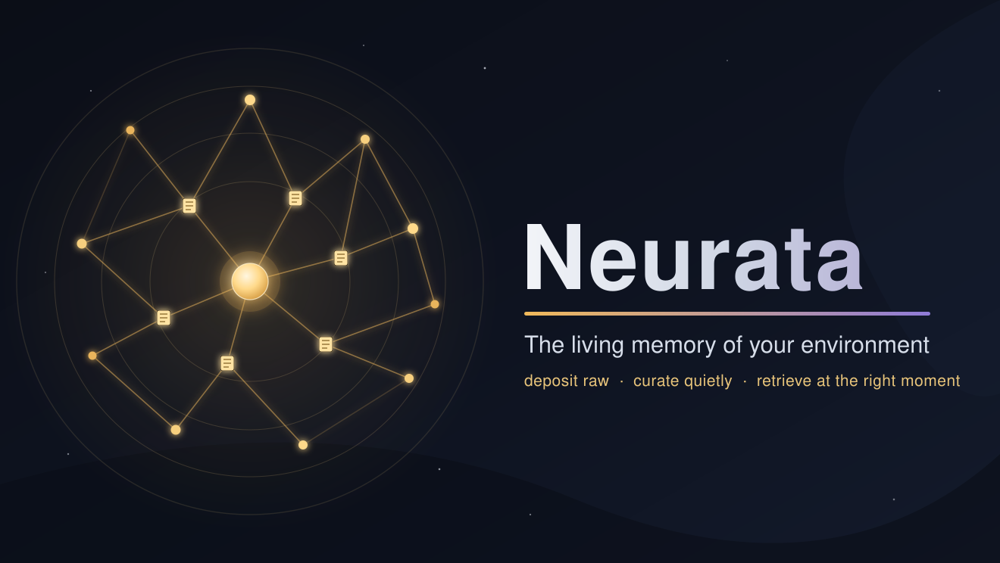

<p align="center">
  
</p>

<p align="center">
  <b>Deposit raw, curate quietly, retrieve at the right moment.</b>
</p>

The living knowledge layer for an agent's **environment** (CLI, IDE,
framework). Companion to [Conscio](https://github.com/Neguiolidas/Conscio),
which minds the agent itself; Neurata minds the agent's world: skills,
tools, docs, decisions — catalogued, curated, retrievable.

## Install

Neurata runs from a dedicated venv (zero runtime deps, but isolated from
the system Python):

```bash
python3 -m venv ~/.venvs/neurata
~/.venvs/neurata/bin/pip install -e /path/to/Neurata
ln -sf ~/.venvs/neurata/bin/neurata ~/.local/bin/neurata
ln -sf ~/.venvs/neurata/bin/neu     ~/.local/bin/neu
```

`~/.local/bin` must be on your PATH. The archive lives in `~/.neurata`
(override with `NEURATA_HOME`).

## Use

```bash
# deposit (stdin via '-', or positional text)
echo "raw content" | neu deposit -
neu deposit "raw content" --title "Note"

# catalogue the inbox (mechanical, reversible — nothing is destroyed)
neu tick

# query (deterministic lexical)
neu query "term"
neu expand <id>          # card → summary → full

# archive health
neu doctor
```

## Automatic curation

`tick` catalogues whatever is in the inbox. Run it hourly via cron:

```cron
0 * * * * $HOME/.local/bin/neurata tick >> $HOME/.neurata/logs/cron-tick.log 2>&1
```

`neu doctor` warns (`last-tick`) if the cron stops.

**Principles**

- Files are the truth (a valid Obsidian vault); the index is a disposable cache.
- Deterministic retrieval first; LLMs only where explicitly wanted.
- Nothing is ever destroyed: archive + quarantine, never delete.
- Zero runtime dependencies. Python ≥ 3.10.

**Status:** release candidate (v0.9). Not yet on PyPI.

**License:** AGPL-3.0-or-later.
